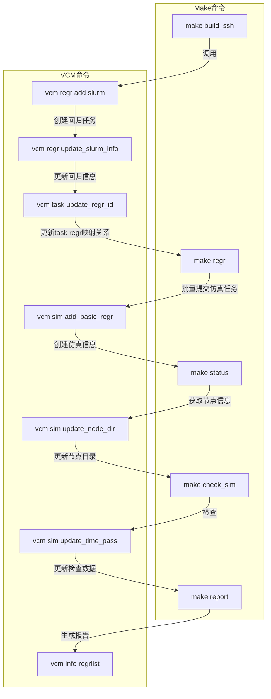
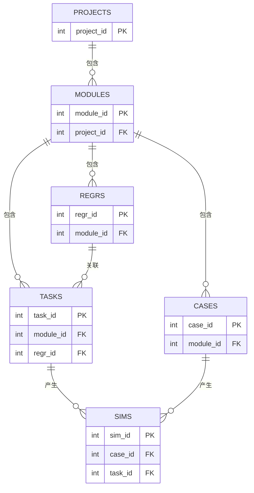

Verification Case Management System (VCM) 详细说明

# 一、系统简介

VCM（Verification Case Management System）是面向数字验证仿真流程的信息管理系统，覆盖项目、模块、用例、任务、仿真等环节。系统以 SQLite 为核心数据库，配合 Python CLI 工具和 Makefile 自动化脚本，支持本地单次仿真和集群回归仿真两大场景，自动采集、统计和可视化仿真过程数据。

## 1.1 功能概述

- **单次仿真**：侧重本地开发、调试，自动采集仿真数据，便于快速追踪问题。
- **回归仿真**：面向集群批量验证，自动化程度高，支持任务、用例、仿真、回归全流程管理与统计。
- **所有功能均可通过 `vcm` 命令行工具统一调用，支持灵活组合与自动化脚本集成。**

## 1.2 功能模块与命令分布

| 功能类别   | 主要命令举例                          | 说明                         |
|------------|--------------------------------------|------------------------------|
| 项目管理   | `vcm project add/list/report/del`    | 项目增删查改、报告生成       |
| 模块管理   | `vcm module add/list/report/del`     | 模块增删查改、报告生成       |
| 用例管理   | `vcm case add/list/report/del`       | 用例增删查改、报告生成       |
| 回归管理   | `vcm regr add/update/list/report`    | 回归任务管理与报告           |
| 任务管理   | `vcm task add/list/update/del`       | 任务登记、状态更新           |
| 仿真管理   | `vcm sim add_basic_single/regr ...`  | 单次/回归仿真数据采集与统计   |
| 信息管理   | `vcm info checkcomp/caselist ...`    | 编译检查、用例采集等         |

---

# 二、核心目录与文件结构

- `vcm.py`：主命令行入口，分发所有子命令。
- `sim`：仿真相关逻辑，包括 CLI、服务、数据库操作等。
- `readme.md`：用户文档。
- 其他目录如 `case`、`task`、`module`、`project` 分别对应各自管理逻辑。

---

# 三、主要功能与流程

VCM 系统功能总览（基于两大场景）

## 3.1 单次仿真流程（sim_pre）

### 3.1.1. 编译任务自动登记：`vcm task add`

**目的**：登记本次编译任务，记录代码版本、编译主机、用户等关键信息，为后续仿真数据采集建立任务关联。

**主要流程**：

1. **目录检查**  
   - 仅允许在 `sim_pre`、`sim_post` 或 `regr` 目录下执行，防止误操作。

2. **读取或初始化任务信息**  
   - 检查当前目录下是否存在 `vcm_task_info.json`，如无则新建。
   - 读取当前用户、主机、编译日志时间等信息。

3. **检查编译日志**  
   - 检查 `comp.log` 是否存在，解析编译结果。
   - 若编译未通过，终止流程并记录失败原因。

4. **判断是否需要更新任务**  
   - 若编译日志未变更且任务已登记，则跳过，避免重复写入。

5. **写入任务信息**  
   - 记录模块名、代码版本（git hash）、主机、用户、编译时间等。
   - 新建任务时写入数据库表 `tasks`，返回 `task_id`。
   - 清空旧的仿真日志关联（sim_logs）。

6. **角点信息登记**  
   - 若为 post 任务，自动解析并登记角点（corner）信息。

7. **保存任务信息**  
   - 更新后的任务信息写入 `vcm_task_info.json`，供后续仿真采集使用。

---

### 3.1.2. 仿真数据自动采集：`vcm sim add_basic_single --sim_time <仿真耗时>`

**目的**：采集本次仿真日志、用例名、种子、仿真时间等，写入数据库并与任务关联。

**主要流程**：

1. **读取任务信息**  
   - 加载当前目录下的 `vcm_task_info.json`，获取 `task_id` 及相关信息。

2. **检查仿真日志**  
   - 检查 `sim.log` 是否存在，自动解析用例名（case_name）、种子（case_seed）等关键信息。

3. **用例与模块校验**  
   - 检查用例是否已登记于数据库，若无则自动补登记。
   - 检查模块信息，确保仿真数据与正确模块关联。

4. **防止重复采集**  
   - 检查 `sim_logs` 是否已存在相同用例名、种子的仿真记录，避免重复写入。

5. **写入仿真数据**  
   - 将仿真数据（用例名、种子、仿真时间、task_id、用户等）写入数据库表 `sim_info`。
   - 生成并追加 `SimItem` 到 `sim_logs`。

6. **仿真结果自动判定**  
   - 自动解析仿真日志，判断功能/时序是否通过，更新 `is_pass`、`error_num`、`timing_num` 等字段。

7. **更新任务信息**  
   - 将新的仿真日志条目追加到 `vcm_task_info.json` 的 `sim_logs` 字段，便于后续统计和追踪。

---

### 3.1.3 典型命令用法

```sh
# 编译后自动登记任务
vcm task add

# 仿真结束后自动采集仿真数据
vcm sim add_basic_single --sim_time <仿真耗时>
```

---

**备注**：  
- 以上流程确保每次仿真都能与唯一的任务信息关联，便于后续统计、追溯和报告生成。  
- 详细字段和数据库结构请参考 readme.md 第四章“数据库结构”部分。

## 3.2 回归仿真流程（slurm）

### 3.2.1. 环境准备与回归任务登记

- **命令**：`make build_ssh`
- **作用**：远程构建仿真环境，拉取代码，登记项目与模块，检查编译。
- **相关代码**：自动化脚本（Makefile），涉及项目、模块登记（`vcm project add`、`vcm module add`）。

#### 1. 新增回归任务
- **命令**：`vcm regr add slurm`
- **作用**：为当前模块创建一条新的回归任务记录。
- **关键数据**：生成回归ID，写入`regr_info`表，并在本地JSON（如`vcm_regr_info.json`）中同步。
- **代码入口**：regr_service.py 的 `add_regr` 方法。

#### 2. 更新回归任务集群信息
- **命令**：`vcm regr update_slurm_info ...`
- **作用**：补充/更新回归任务的分区、节点、用例列表等SLURM相关信息。
- **关键数据**：更新`regr_info`表和本地JSON。
- **代码入口**：regr_service.py 的 `update_slurm_info` 方法。

#### 3. 任务与回归ID关联
- **命令**：`vcm task update_regr_id`
- **作用**：将已登记的任务与回归ID进行关联，便于后续仿真数据归档。
- **关键数据**：更新`tasks`表的`regr_id`字段。

---

### 3.2.2. 批量仿真任务提交

- **命令**：`make regr`
- **作用**：批量提交所有用例的仿真任务到SLURM集群。
- **关键数据**：生成作业(job)并记录job_id，通常写入`status.log`等文件。

#### 1. 批量提交集群作业基础信息
- **命令**：`vcm sim add_basic_regr`
- **作用**：根据`status.log`和`log/reg_info.log`，批量采集仿真日志，登记到数据库和本地JSON。
- **关键数据**：写入`sim_info`表，生成`SimItem`，更新`RegrItem`。
- **代码入口**：handle_add_basic_regr.py 的 `handle_add_basic_regr`。

---

### 3.2.3. 仿真节点与目录信息采集

- **命令**：`make status`
- **作用**：自动采集所有仿真任务的状态，更新`status_check.log`等。
- **关键数据**：采集job状态、节点名等。

#### 1. 更新仿真节点与目录
- **命令**：`vcm sim update_node_dir`
- **作用**：根据最新的状态日志，更新每个仿真任务的节点名、目录、日志路径等信息。
- **关键数据**：更新`sim_info`表的`job_dir`、`job_id`、`node_name`等字段。
- **代码入口**：handle_update_node_dir.py 的 `handle_update_node_dir`。

---

### 3.2.4. 仿真结果统计与判定

- **命令**：`make check_sim`
- **作用**：统计所有已完成仿真的时间、错误数、通过状态等。
- **关键数据**：采集仿真耗时、错误数、通过状态等。

#### 1. 更新仿真统计信息
- **命令**：`vcm sim update_time_pass`
- **作用**：批量统计仿真时间、错误数、通过状态，写入数据库。
- **关键数据**：更新`sim_info`表的`sim_time`、`error_num`、`is_pass`等字段。
- **代码入口**：handle_sim_time_pass.py 的 `handle_sim_time_pass`。

---

### 3.2.5. 生成报告与可视化

- **命令**：`make report`
- **作用**：生成项目、模块、用例等多维度的详细报告。
- **关键数据**：汇总数据库中的仿真、任务、回归等信息，生成HTML或表格报告。

#### 1. 查询回归列表
- **命令**：`vcm info regrlist`
- **作用**：查询当前所有回归任务及其状态，便于追踪和管理。

---

## 总结流程图



---

## 代码与数据流核心说明

- **回归任务（RegrItem）**：通过`vcm regr add slurm`和`update_slurm_info`登记，管理用例列表、节点、分区等信息。
- **仿真任务（SimItem）**：通过`vcm sim add_basic_regr`批量采集，后续通过`update_node_dir`和`update_time_pass`补全节点、目录、统计信息。
- **数据库表**：`regr_info`、`sim_info`、`tasks`等，贯穿整个流程。
- **本地JSON**：如`vcm_regr_info.json`，用于缓存和追踪回归任务状态。

---

## 典型命令速查

- `make build_ssh`：环境准备
- `vcm regr add slurm`：新增回归任务
- `vcm regr update_slurm_info ...`：补充集群信息
- `vcm task update_regr_id`：任务与回归ID关联
- `make regr`：批量提交仿真
- `vcm sim add_basic_regr`：采集仿真日志
- `make status`：采集仿真状态
- `vcm sim update_node_dir`：更新节点与目录
- `make check_sim`：统计仿真结果
- `vcm sim update_time_pass`：更新统计信息
- `make report`：生成报告
- `vcm info regrlist`：查询回归列表

----

# 四、数据库结构

VCM 系统数据库基于 SQLite，主要包含以下表和视图：



## 4.1 主要表结构

- **projects**  
  项目信息，包含项目名、创建时间、创建人等。

- **modules**  
  模块信息，关联项目，包含模块名、所属项目、创建信息等。

- **case_info**  
  用例信息，关联模块，包含用例名、中文名、分组、特性支持等。

- **regr_info**  
  回归任务信息，关联模块，记录回归类型、节点、用例列表等。

- **tasks**  
  任务信息，关联模块和回归任务，记录代码版本、角点、是否回归等。

- **sim_info**  
  仿真信息，关联用例和任务，记录仿真种子、时间、错误数、通过状态等。

## 4.2 主要视图

- **project_modules_view**  
  项目与模块的关联视图。

- **module_case_view**  
  模块、项目与用例的综合视图。

- **module_task_view**  
  模块与任务的综合视图，便于查询模块下所有任务或特定类型任务。

- **task_sim_view**  
  任务与仿真信息的综合视图，便于统计仿真结果。

---

# 五、主要 Python 代码结构与函数说明

## 5.1. CLI 入口与分发

### `vcm.py`

- 解析命令行参数，分发到各子命令（project、module、case、regr、task、sim、info）。
- 注意事项：
  - 所有命令均需传递数据库游标和日志对象。
  - 子命令参数需严格匹配，否则会报错。

可以参考如下方式重写 vcm_cli.py 的介绍，更加清晰、结构化地说明其作用和主要接口：

### `vcm_cli.py`

- **作用**：  
  作为 VCM 系统的命令行参数解析与分发入口，负责注册所有一级和二级子命令，并将命令参数传递给对应功能模块（如项目、模块、用例、回归、任务、仿真、信息等）。

- **主要接口**：
  - `VCMCLI.parse_cmd()`  
    初始化命令行解析器，注册所有子命令（包括 project、module、case、regr、task、sim、info 等），并返回 `argparse.ArgumentParser` 对象。
  - 各功能模块（如 `ProjectCLI`、`ModuleCLI`、`SimCLI` 等）需实现 `add_xxx_subcommands(subparsers)` 方法，用于注册各自的二级子命令和参数。

- **使用说明**：
  - 支持多级子命令结构，所有命令均通过 `vcm` 统一入口调用。
  - 子命令参数需与各模块 `add_xxx_subcommands` 定义保持一致。
  - 未知命令或参数错误时会自动提示帮助信息。
  - 支持全局参数（如 `-v/--version`、`-l/--level`、`-debug` 等）。

- **注意事项**：
  - 所有命令的实际处理逻辑由各功能模块实现，vcm_cli.py 仅负责参数解析与分发。
  - 新增功能时需在此文件注册对应子命令，并在相应模块实现处理函数。


# 六、Makefile 自动化脚本注意事项

## `sim_pre/makefile`

- `restart` 需确保所有编译目标均已完成。
- `sim` 需保证仿真可执行文件和日志文件存在，仿真结束后自动调用 VCM 采集信息。

## `slurm/makefile`

- `build_ssh` 需确保远程环境变量、用例列表、编译环境均正确。
- `regr` 需保证所有用例均能正常提交仿真任务。
- `status` 需能正确收集所有仿真状态，自动批量写入数据库。
- `check_sim` 需能统计所有仿真时间、错误数、通过状态，异常需有日志提示。

---

# 七、报告与可视化

- 支持主要组件的命令行形式报告。

---

# 八、常见问题与建议

- 数据库文件损坏或丢失时，建议重新初始化数据库。
- 删除项目、模块、用例等操作需谨慎，需输入授权码。
- 仿真日志格式变更时，需同步更新解析逻辑。
- 建议定期备份数据库和关键日志文件。

---

# 九、作者与联系方式

- **作者**：zhhe
- **联系方式**：zhhe@mail.geo

---

如需进一步了解各函数实现细节，请查阅源码注释或联系作者。
