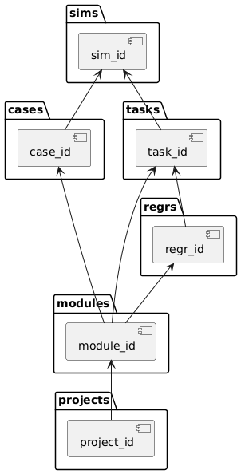

Verification Case Management System (VCM) 详细说明

# 一、系统简介

VCM（Verification Case Management System）是面向数字验证仿真流程的信息管理工具，覆盖项目、模块、用例、任务、仿真等环节。系统以 SQLite 为核心数据库，配合 Python CLI 工具和 Makefile 自动化脚本，支持本地单次仿真和集群回归仿真两大场景，自动采集、统计和可视化仿真过程数据。

## 1.1 功能概述

- **单次仿真**：侧重本地开发、调试，自动采集仿真数据，便于快速追踪问题。
- **回归仿真**：面向集群批量验证，自动化程度高，支持任务、用例、仿真、回归全流程管理与统计。
- **所有功能均可通过 `vcm` 命令行工具统一调用，支持灵活组合与自动化脚本集成。**

## 1.2 功能模块与命令分布

| 功能类别   | 主要命令举例                          | 说明                         |
|------------|--------------------------------------|------------------------------|
| 项目管理   | `vcm project add/list/report/del`    | 项目增删查改、报告生成       |
| 模块管理   | `vcm module add/list/report/del`     | 模块增删查改、报告生成       |
| 用例管理   | `vcm case add/list/report/del`       | 用例增删查改、报告生成       |
| 回归管理   | `vcm regr add/update/list/report`    | 回归任务管理与报告           |
| 任务管理   | `vcm task add/list/update/del`       | 任务登记、状态更新           |
| 仿真管理   | `vcm sim add_basic_single/regr ...`  | 单次/回归仿真数据采集与统计   |
| 信息管理   | `vcm info checkcomp/caselist ...`    | 编译检查、用例采集等         |

---

# 二、核心目录与文件结构

- `vcm.py`：主命令行入口，分发所有子命令。
- `sim`：仿真相关逻辑，包括 CLI、服务、数据库操作等。
- `readme.md`：用户文档。
- 其他目录如 `case`、`task`、`module`、`project` 分别对应各自管理逻辑。

---

# 三、主要功能与流程

VCM 系统功能总览（基于两大场景）

## 3.1 单次仿真流程（sim_pre）

### 3.1.1 编译与仿真操作
  - `make restart`：全量编译。
  - `make sim`：运行仿真并采集日志。

### 3.1.2 编译任务自动登记
  - 编译阶段自动登记任务：
    ```sh
    vcm task add
    ```

### 3.1.3 仿真数据自动采集
  - 仿真结束后自动调用：
    ```sh
    vcm sim add_basic_single --sim_time <仿真耗时>
    ```
  - 功能：采集本次仿真日志、用例名、种子、仿真时间等，写入数据库。


### 相关命令与功能

- `vcm sim add_basic_single`  
  采集单次仿真数据，自动解析日志并入库。
- `vcm task add`  
  新增仿真任务记录。
- `vcm project/module/case/task/sim ...`  
  支持项目、模块、用例、任务、仿真等全流程管理。

## 3.2 回归仿真（slurm）

### 3.2.1 环境准备
- `make build_ssh`  
  远程构建环境、拉取代码、登记项目与模块、检查编译。

### 3.2.2 用例与任务管理
- `make checkcase`  
  采集用例列表，登记到数据库。
- `vcm regr add slurm`  
  新增回归任务。
- `vcm regr update_slurm_info ...`  
  更新回归任务的集群信息。
- `vcm task update_regr_id`  
  关联任务与回归ID。

### 3.2.3 批量仿真与状态采集
- `make regr`  
  批量提交所有用例仿真任务。
- `make status`  
  自动采集所有仿真状态，批量写入数据库。
- `vcm sim add_basic_regr`  
  批量采集回归仿真日志。
- `vcm sim update_node_dir`  
  更新仿真节点与目录信息。

### 3.2.4 仿真结果统计
- `vcm sim update_time_pass`  
  统计所有仿真时间、错误数、通过状态，更新数据库。

### 3.2.5 报告与可视化
- `vcm project report <project_name>`  
  生成项目详细报告。
- `vcm module report <module_name>`  
  生成模块报告。
- `vcm case report <case_name>`  
  生成用例报告。

---

### 常用命令速查

- `vcm init`  
  自动初始化项目和模块。
- `vcm info checkcomp ...`  
  检查编译状态。
- `vcm info caselist <case_list>`  
  采集用例列表。
- `vcm sim add_basic_regr`  
  批量采集回归仿真数据。
- `vcm sim update_node_dir`  
  更新仿真节点与目录。
- `vcm sim update_time_pass`  
  统计仿真时间与通过状态。
- `vcm regr add slurm`  
  新增回归任务。
- `vcm regr update_slurm_info ...`  
  更新回归任务集群信息。
- `vcm task update_regr_id`  
  任务与回归ID关联。
---

# 四、数据库结构

VCM 系统数据库基于 SQLite，主要包含以下表和视图：



## 4.1 主要表结构

- **projects**  
  项目信息，包含项目名、创建时间、创建人等。

- **modules**  
  模块信息，关联项目，包含模块名、所属项目、创建信息等。

- **case_info**  
  用例信息，关联模块，包含用例名、中文名、分组、特性支持等。

- **regr_info**  
  回归任务信息，关联模块，记录回归类型、节点、用例列表等。

- **tasks**  
  任务信息，关联模块和回归任务，记录代码版本、角点、是否回归等。

- **sim_info**  
  仿真信息，关联用例和任务，记录仿真种子、时间、错误数、通过状态等。

## 4.2 主要视图

- **project_modules_view**  
  项目与模块的关联视图。

- **module_case_view**  
  模块、项目与用例的综合视图。

- **module_task_view**  
  模块与任务的综合视图，便于查询模块下所有任务或特定类型任务。

- **task_sim_view**  
  任务与仿真信息的综合视图，便于统计仿真结果。

---

# 五、主要 Python 代码结构与函数说明

## 5.1. CLI 入口与分发

### `vcm.py`

- 解析命令行参数，分发到各子命令（project、module、case、regr、task、sim、info）。
- 注意事项：
  - 所有命令均需传递数据库游标和日志对象。
  - 子命令参数需严格匹配，否则会报错。

可以参考如下方式重写 vcm_cli.py 的介绍，更加清晰、结构化地说明其作用和主要接口：

### `vcm_cli.py`

- **作用**：  
  作为 VCM 系统的命令行参数解析与分发入口，负责注册所有一级和二级子命令，并将命令参数传递给对应功能模块（如项目、模块、用例、回归、任务、仿真、信息等）。

- **主要接口**：
  - `VCMCLI.parse_cmd()`  
    初始化命令行解析器，注册所有子命令（包括 project、module、case、regr、task、sim、info 等），并返回 `argparse.ArgumentParser` 对象。
  - 各功能模块（如 `ProjectCLI`、`ModuleCLI`、`SimCLI` 等）需实现 `add_xxx_subcommands(subparsers)` 方法，用于注册各自的二级子命令和参数。

- **使用说明**：
  - 支持多级子命令结构，所有命令均通过 `vcm` 统一入口调用。
  - 子命令参数需与各模块 `add_xxx_subcommands` 定义保持一致。
  - 未知命令或参数错误时会自动提示帮助信息。
  - 支持全局参数（如 `-v/--version`、`-l/--level`、`-debug` 等）。

- **注意事项**：
  - 所有命令的实际处理逻辑由各功能模块实现，vcm_cli.py 仅负责参数解析与分发。
  - 新增功能时需在此文件注册对应子命令，并在相应模块实现处理函数。

---

## 5.2. 仿真服务与数据库操作


---

# 六、Makefile 自动化脚本注意事项

## `sim_pre/makefile`

- `restart` 需确保所有编译目标均已完成。
- `sim` 需保证仿真可执行文件和日志文件存在，仿真结束后自动调用 VCM 采集信息。

## `slurm/makefile`

- `build_ssh` 需确保远程环境变量、用例列表、编译环境均正确。
- `regr` 需保证所有用例均能正常提交仿真任务。
- `status` 需能正确收集所有仿真状态，自动批量写入数据库。
- `check_sim` 需能统计所有仿真时间、错误数、通过状态，异常需有日志提示。

---

# 七、报告与可视化

- 支持主要组件的命令行形式报告。

---

# 八、常见问题与建议

- 数据库文件损坏或丢失时，建议重新初始化数据库。
- 删除项目、模块、用例等操作需谨慎，需输入授权码。
- 仿真日志格式变更时，需同步更新解析逻辑。
- 建议定期备份数据库和关键日志文件。

---

# 九、作者与联系方式

- **作者**：zhhe
- **联系方式**：zhhe@mail.geo

---

如需进一步了解各函数实现细节，请查阅源码注释或联系作者。
